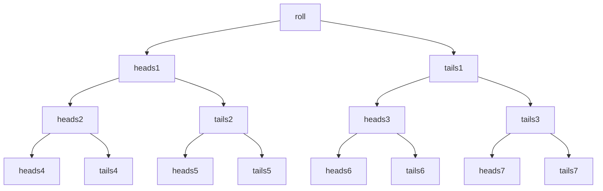

Term | Definition
-- | --
experiment | the process by which an observation is obtained either controlled or uncontrolled
simple event | a possible outcome observed on a single repetition of an experiment denoted by E with a subscript
event | a cluster of simple events based on a condition
mutually exclusive | two events that cannot occur at the same time don't share any simple events
sample space | set of all simple events/possible outcomes denoted by S can be visualized with a tree diagram or table of events if the experiments consists of multiple stages

### Exercise 1

Event | Outcome | Is Majority
-- | -- | --
E1 | HHH | yes
E2 | HHT | yes
E3 | HTH | yes
E4 | HTT | no
E5 | THH | yes
E6 | THT | no
E7 | TTH | no
E8 | TTT | no

### Exercise 2
E = {J4, Q4, K4, A3, 22, 3A, 4J, 4Q, 4K}
22 = 12 because cannot have the same suit
outcomes = 16 * 8  +12 = 140