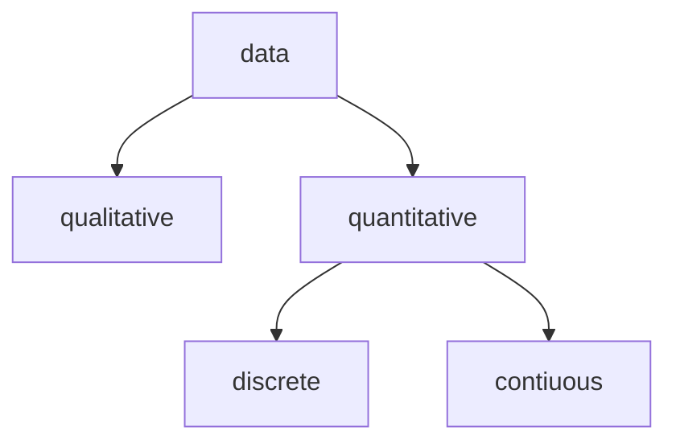

Term | Definition
-- | --
variable | characteristics that varies over time and/or different entities
data | a measured variable on a set of experimental units
experimental unit | the object on which a variable is measured. a measurement results when a variable is measured on an experimental unit. e.g. when measuring land masses, each plot of land is an experimental unit
population | set of all measurements
sample | any subset of measurements selected from population

note: if a measurement is obtained for every experimental unit in the collection, the resulting data is the population. any smaller subsets of measurements is a sample

# Types of data

Term | Definition
-- | --
univariate data | single variable is measured on a experimental unit
bivariate data | two variables are measured on a experimental unit
multivariate data | more than two variables measured

# Types of variables

Term | Definition
-- | --
qualitative variables | measure quality/characteristic
quantitative variables | measure numerical quantity
discrete variable | finite/countable number of.. = discrete
continuous variable | many values corresponding to points on a line interval infinite

# Levels of measurement

Term | Definition
-- | --
nominal | <ul><li>names, labels, categories<li>no hierarchy<li>e.g. books</ul>
ordinal | <ul><li>hierarchy<li>differences between values are meaningless or cannot be determined<li>provide information about relative comparison but not magnitude of difference<li>e.g. Likert scale</ul>
interval | <ul><li>difference between two values is meaningful<li>0 does not mean nothing<li>ratios are meaningless<li>e.g. temperature; 40°C is not twice as hot as 20°C</ul>
ratio | <ul><li>0 indicates no quantity<li>ratios are meaningful<li>e.g. distance travelled</ul>
